# Task 1 — RTL Synthesis of GF(2⁸) Multiplier

> **Tool:** Synopsys Design Compiler V-2023.12-SP4  
> **Technology:** SAED 14nm Standard Cell Library (RVT)  
> **Verification:** Synopsys VCS + Verdi  

---

## Objective

Synthesize a GF(2⁸) multiplier using Synopsys Design Compiler and evaluate area, timing, and power under five different configurations: single RVT library, multi-VT, PVT corners, delay-priority optimization, and leakage/dynamic power optimization.

---

## Design — `gf8_mul`

Multiplies two 8-bit elements in GF(2⁸) using the AES irreducible polynomial `x⁸ + x⁴ + x³ + x + 1` (0x11B). Fully combinational shift-and-XOR product with modular reduction, followed by a 1-cycle registered output.

```verilog
module gf8_mul (
    input  wire       clk,   // synchronous clock
    input  wire       rst,   // synchronous active-high reset
    input  wire [7:0] a,     // multiplicand
    input  wire [7:0] b,     // multiplier
    output reg  [7:0] y      // GF(2⁸) product — 1-cycle latency
);
```

---

## Functional Verification — VCS/Verdi

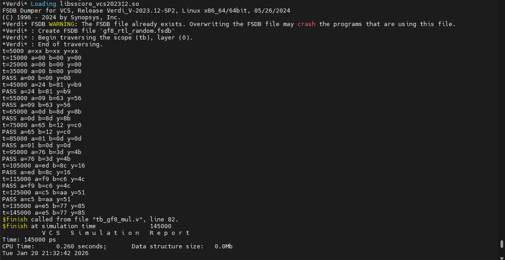
*Fig. 1: VCS simulation terminal output and Verdi waveform*

| Test Vector | a | b | Expected y | Result |
|-------------|---|---|-----------|--------|
| AES FIPS 197 | 0x57 | 0x83 | 0xC1 | ✅ PASS |
| Simple field | 0x02 | 0x03 | 0x06 | ✅ PASS |
| High-value | 0xFF | 0x13 | 0xE5 | ✅ PASS |

Simulation end time: **145,000 ps**. All assertions passed.

---

## DC Synthesis Script

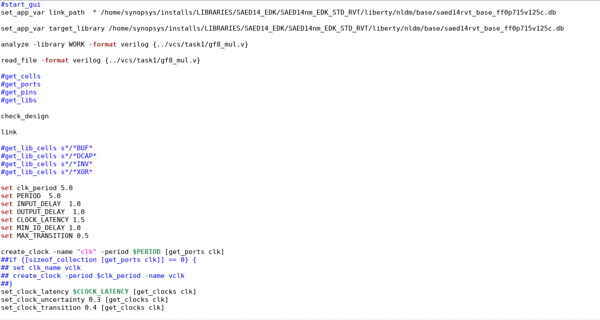
*Fig. 2: DC synthesis TCL script*

Key constraints:
| Parameter | Value |
|-----------|-------|
| Clock period | 5.00 ns |
| Clock latency | 1.50 ns |
| Clock uncertainty | 0.30 ns |
| Input delay | 1.00 ns |
| Max transition | 0.50 ns |
| Wire load model | 8000 (top) |

---

## Script 1 — Single RVT Library (Baseline)

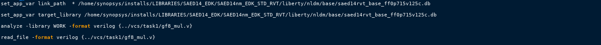
*Fig. 3: Area report — 1_gf8_mul.tcl*

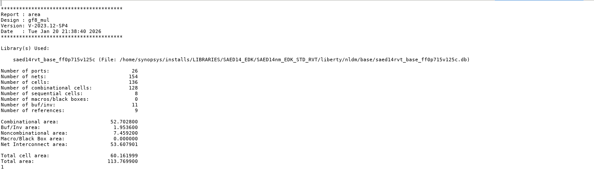
*Fig. 4: Power report — 1_gf8_mul.tcl*


*Fig. 5: Timing report — 1_gf8_mul.tcl*

| Metric | Value |
|--------|-------|
| Total Area | 113.769 µm² |
| Total Power | 25.27 µW |
| Slack (MET) | **+3.16 ns** ✅ |

---

## Script 2 — Multi-VT (RVT + HVT + LVT)

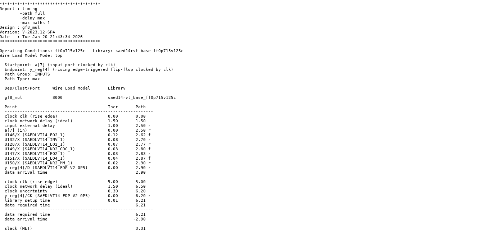
*Fig. 6: Timing report — 2_gf8_mul.tcl*

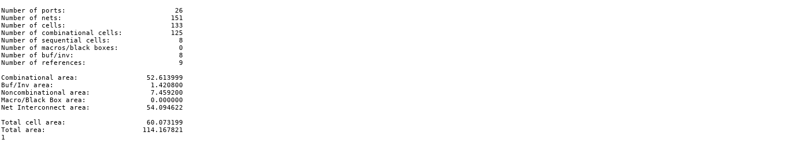
*Fig. 7: Area report — 2_gf8_mul.tcl*

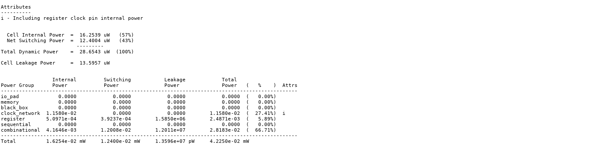
*Fig. 8: Power report — 2_gf8_mul.tcl*

| Metric | Value |
|--------|-------|
| Total Area | 114.167 µm² |
| Total Power | 42.25 µW |
| Slack (MET) | **+3.31 ns** ✅ |

---

## Script 3 — RVT with Multiple PVT Corners

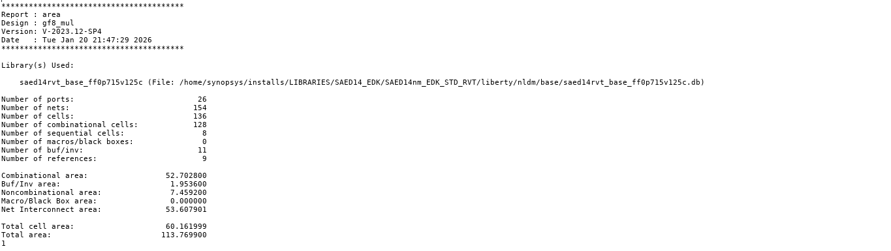
*Fig. 9: Area report — 3_gf8_mul.tcl (ss0p585v125c corner)*

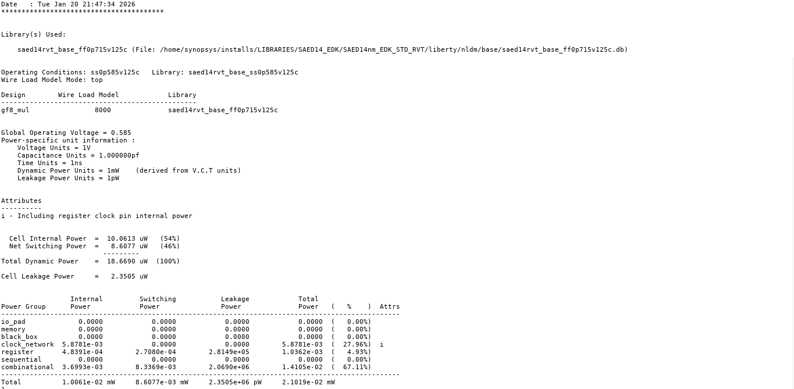
*Fig. 10: Power report — 3_gf8_mul.tcl*

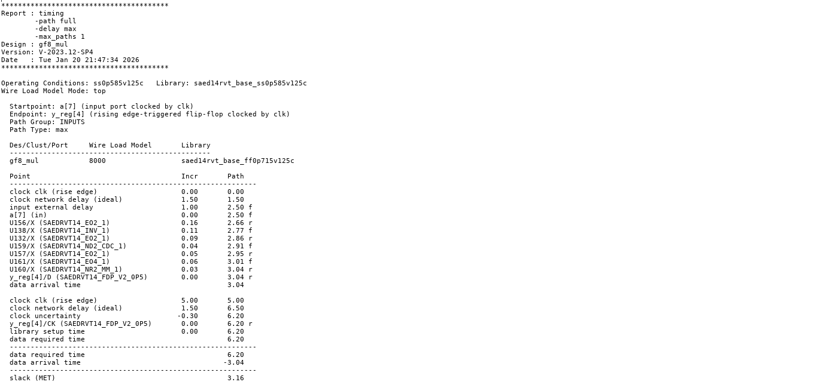
*Fig. 11: Timing report — 3_gf8_mul.tcl*

| Metric | Value |
|--------|-------|
| Total Area | 113.769 µm² |
| Total Power | 21.02 µW |
| Slack (MET) | **+3.16 ns** ✅ |

---

## Script 4 — Delay-Priority Optimization

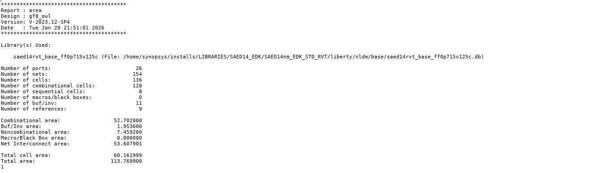
*Fig. 12: Area report — 4_gf8_mul.tcl (`set_cost_priority -delay`)*


*Fig. 13: Power report — 4_gf8_mul.tcl*

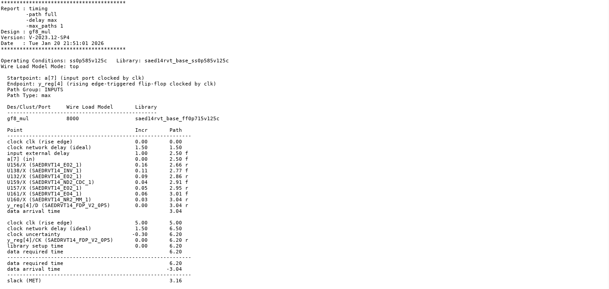
*Fig. 14: Timing report — 4_gf8_mul.tcl*

| Metric | Value |
|--------|-------|
| Total Area | 113.769 µm² |
| Total Power | 21.02 µW |
| Slack (MET) | **+3.16 ns** ✅ |

---

## Script 5 — Leakage & Dynamic Power Optimization

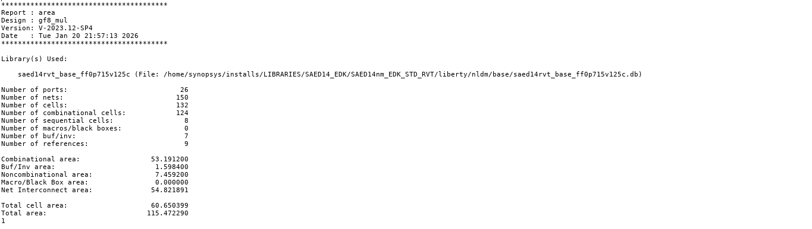
*Fig. 15: Area report — 5_gf8_mul.tcl (`set_leakage_optimization + set_dynamic_optimization`)*

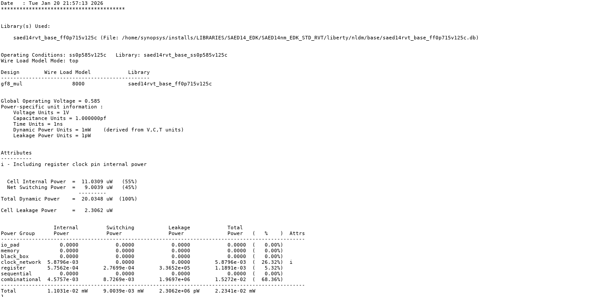
*Fig. 16: Power report — 5_gf8_mul.tcl*

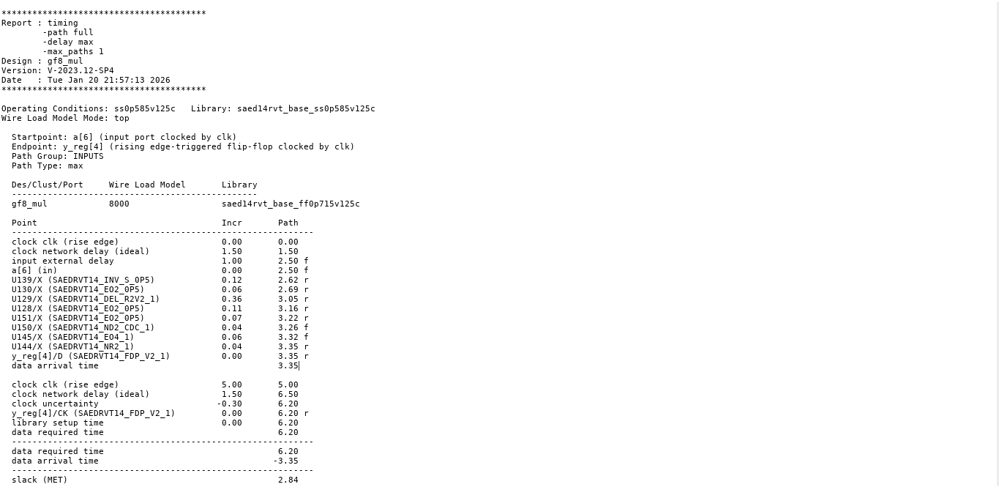
*Fig. 17: Timing report — 5_gf8_mul.tcl*

| Metric | Value |
|--------|-------|
| Total Area | 115.472 µm² |
| Total Power | 22.34 µW |
| Slack (MET) | **+2.84 ns** ✅ |

---

## Observations & Summary

| Script | Configuration | Area (µm²) | Power (µW) | Slack (ns) |
|--------|--------------|-----------|-----------|-----------|
| `1_gf8_mul.tcl` | Single RVT — baseline | 113.769 | 25.27 | 3.16 |
| `2_gf8_mul.tcl` | Multi-VT (RVT+HVT+LVT) | 114.167 | 42.25 | 3.31 |
| `3_gf8_mul.tcl` | RVT + PVT corners | 113.769 | 21.02 | 3.16 |
| `4_gf8_mul.tcl` | RVT + delay priority | 113.769 | 21.02 | 3.16 |
| `5_gf8_mul.tcl` | RVT + power opt | 115.472 | 22.34 | 2.84 |

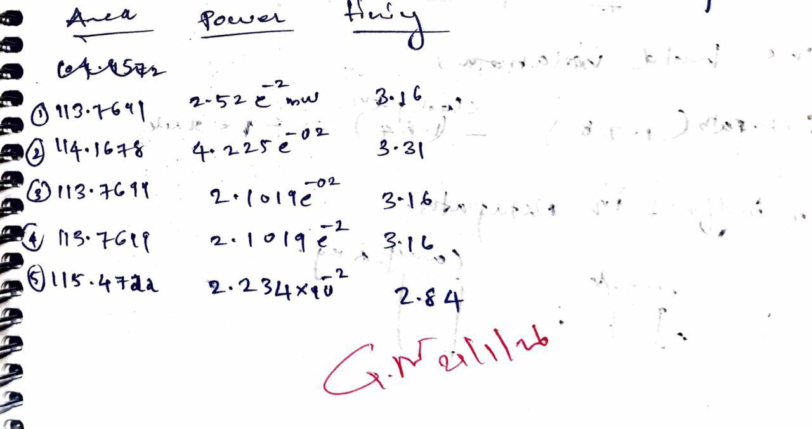
*Fig. 21: Manual verification of results*

---

## Appendix — RTL & Testbench

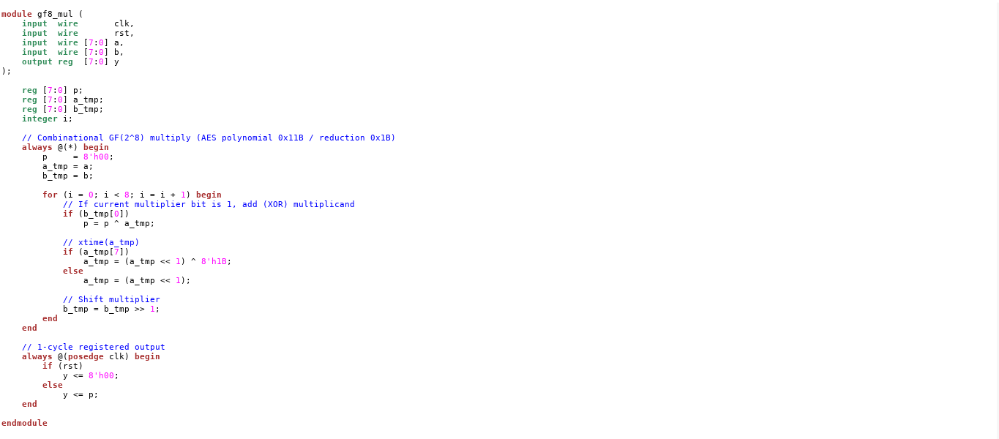
*Fig. 18: `gf8_mul.v` RTL source*

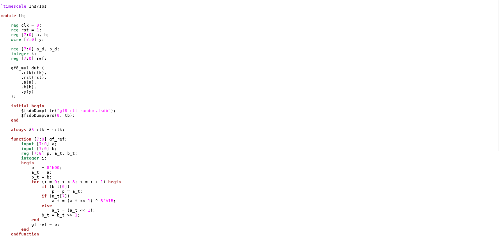
*Fig. 19: `tb_gf8_mul.v` testbench*

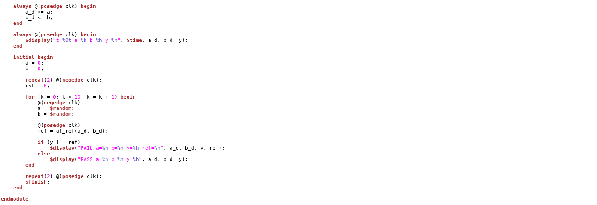
*Fig. 20: RTL schematic from Design Vision*

---

## Conclusion

LVT configurations suit performance-critical paths; HVT/multi-VT suit low-power applications. All five synthesis runs met the 5 ns clock constraint with positive slack.
