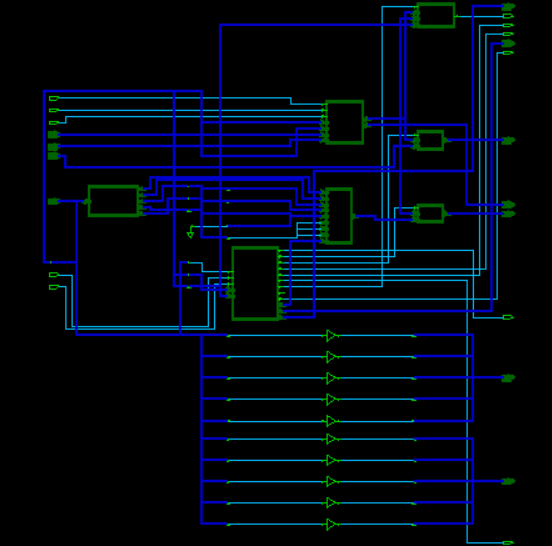
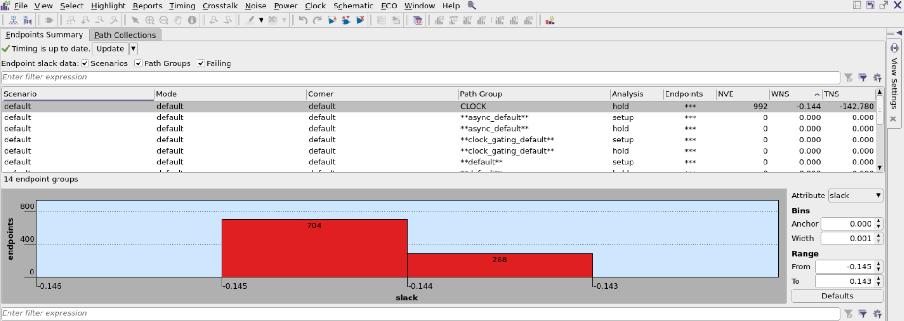
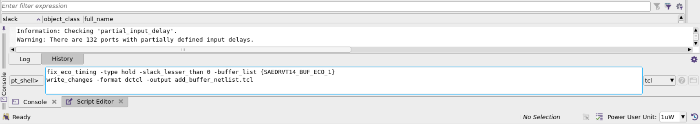
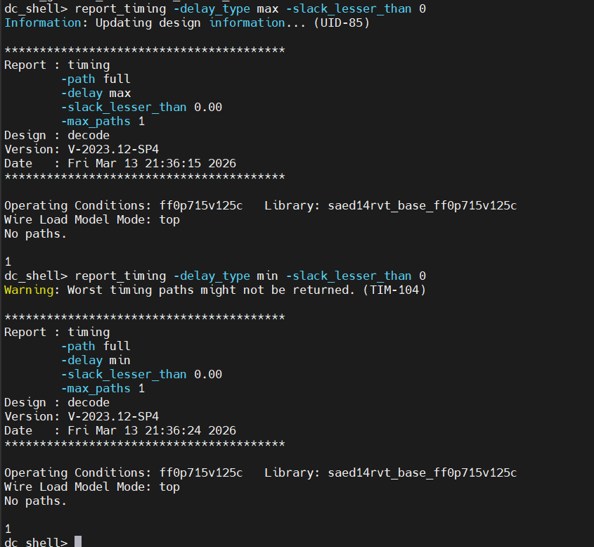
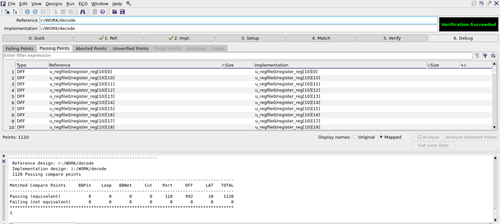

# Task 2 — Static Timing Analysis & Logical Equivalence Checking

> **Design:** RISC-V Decoder (`decode`)  
> **Tools:** Synopsys PrimeTime · Synopsys Formality · Synopsys Design Compiler  
> **Technology:** SAED 14nm RVT (ff0p715v125c)  
> **Date:** Fri Mar 13, 2026  

---

## Objective

1. Perform STA on the synthesized RISC-V decoder using PrimeTime — identify setup and hold violations.
2. Fix violations via ECO buffer insertion and resynthesize.
3. Verify functional equivalence between RTL and gate-level netlist using Formality.

---

## Design Schematic


*Fig. 1: Schematic of the RISC-V Decode unit (Design Vision)*

---

## Section 1 — PrimeTime STA Flow

### Commands

```tcl
# 1. Library setup
set link_library   "* saed14rvt_base_ff0p715v125c.db"
set target_library "saed14rvt_base_ff0p715v125c.db"

# 2. Read netlist
read_verilog {../dc/reports/decoder_netlist.v}
current_design decode
link

# 3. Apply constraints
source {../dc/reports/decoder_constraints.sdc}
check_timing
update_timing -full

# 4. Generate reports
report_timing                         > ./reports/decoder_timing.rpt
report_timing -delay_type min         > ./reports/decoder_delay_type_min.rpt
report_analysis_coverage              > ./reports/decoder_coverage

# 5. Detailed path reports
report_timing -from [all_inputs] -max_paths 20 \
    -to [all_registers -data_pins]              > reports/timing.rpt
report_timing -from [all_registers -clock_pins] -max_paths 20 \
    -to [all_registers -data_pins]              > reports/su.timing.rpt
report_timing -from [all_registers -clock_pins] -max_paths 20 \
    -to [all_registers -data_pins] -delay_type min > reports/hold.timing.rpt

# 6. Transition/capacitance detail
report_timing -transition_time -capacitance -nets -input_pins \
    -from [all_registers -clock_pins] \
    -to   [all_registers -data_pins]  > reports/timing.tran.cap.rpt
```

### Initial STA Results


*Fig. 2: PrimeTime GUI showing hold-violating endpoints*

| Path Group | Analysis | Endpoints | WNS (ns) | TNS (ns) |
|------------|----------|-----------|---------|---------|
| CLOCK | hold | 992 | **−0.144** | **−142.780** |
| All others | setup/hold | *** | 0.000 | 0.000 |

**Finding:** 992 hold-violating endpoints. No setup violations.

---

## Section 2 — ECO Fix


*Fig. 3: Updated TCL script for fixing hold violations via buffer insertion*

```tcl
fix_eco_timing -type hold -slack_lesser_than 0 \
    -buffer_list {SAED14nm_BUF_ECO_1}
write_changes -format dctcl -output add_buffer_netlist.tcl
```

Then in Design Compiler:
```tcl
source add_buffer_netlist.tcl
```

---

## Section 3 — Post-Fix STA Results


*Fig. 4: Final timing report — no paths with slack < 0 for setup or hold*

| Check | WNS | TNS | Violations |
|-------|-----|-----|-----------|
| Setup (max delay) | **0.00 ns ✅** | **0.00 ns ✅** | **0 ✅** |
| Hold (min delay) | **0.00 ns ✅** | **0.00 ns ✅** | **0 ✅** |

---

## Section 4 — Logical Equivalence Checking (Formality)

```tcl
read_db -tech ".../saed14rvt_base_ff0p715v125c.db"
read_verilog -r ../vcs/Decode.v       ; set_top decode   # Reference RTL
read_verilog -i ../dc/reports/cu_netlist.v ; set_top decode  # Implementation
match
verify
report_designs           > ./decode_design_report.rpt
report_matched_points    > ./decode_design_matched_point.rpt
report_unmatched_points  > ./decode_design_unmatched_point.rpt
report_unverified_points > ./decode_design_unverified_point.rpt
```


*Fig. 5: Formality — Verification SUCCEEDED, 1120/1120 compare points passing*

| Metric | Value |
|--------|-------|
| Reference design | `r:/WORK/decode` (RTL) |
| Implementation | `i:/WORK/decode` (netlist) |
| Matched compare points | **1,120** |
| Passing (equivalent) | **1,120 ✅** |
| Failing | **0 ✅** |

**Status: Verification SUCCEEDED ✅**

---

## Conclusion

PrimeTime identified 992 hold violations (WNS = −0.144 ns). ECO buffer insertion resolved all violations. Post-fix STA confirmed zero setup and hold violations. Formality LEC confirmed 1,120/1,120 compare points equivalent — the synthesized netlist is functionally identical to the original RTL.
