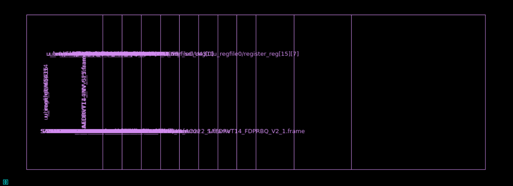
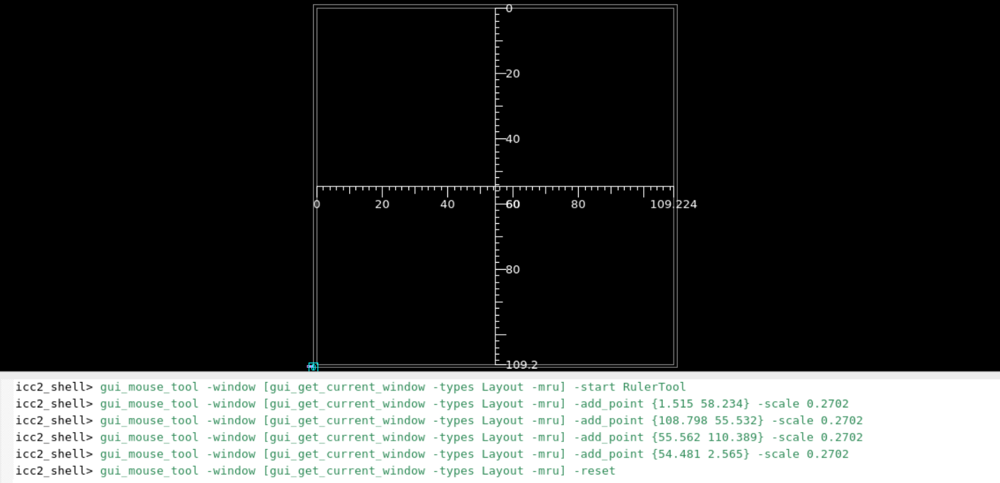
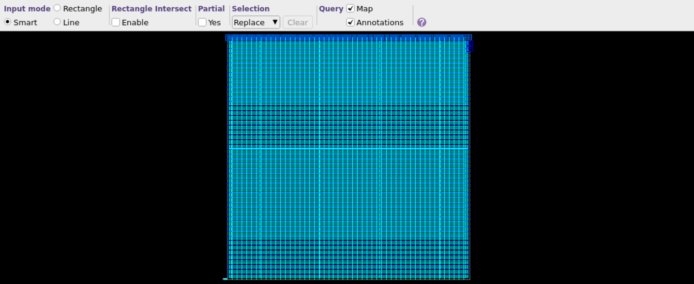
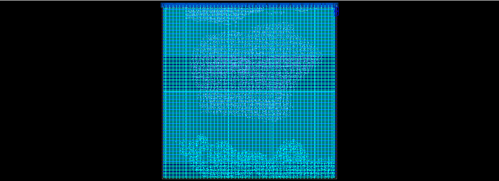
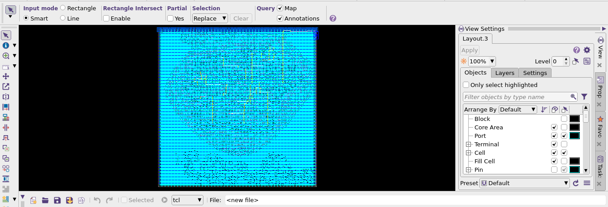
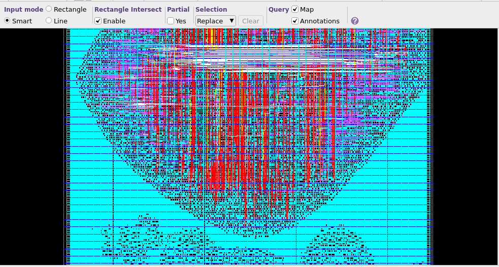
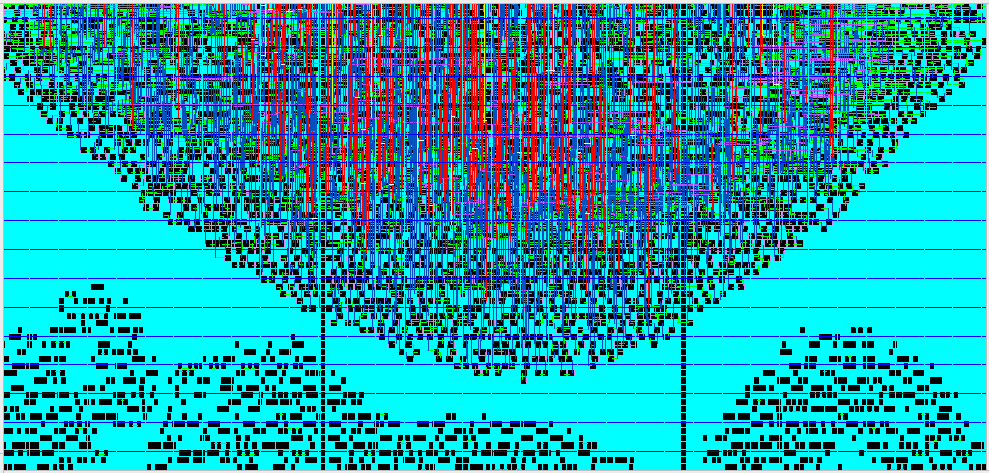
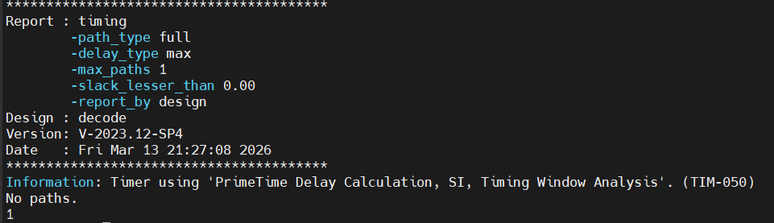

# Task 3 — ASIC Physical Design Flow

> **Design:** RISC-V Decoder (`decode`)  
> **Tool:** Synopsys IC Compiler II (ICC2) V-2023.12-SP4  
> **Technology:** SAED 14nm RVT  
> **Date:** Fri Mar 13, 2026  

---

## Objective

Execute the complete ASIC physical design flow: netlist import → MMMC setup → floorplanning → power planning → placement → CTS → routing → post-route timing closure.

---

## Section 1 — Netlist Import

```tcl
read_verilog  ../dc/reports/decoder_netlist.v
current_design decoder
link
save_lib -as post_import_design
```


*Fig. 1: ICC2 after importing the synthesized netlist — initial view*

---

## Section 2 — MMMC Setup

```tcl
create_corner slow ; create_corner fast
create_mode func
create_scenario -mode func -corner fast -name func_fast
create_scenario -mode func -corner slow -name func_slow
```

| Scenario | Corner | Purpose |
|----------|--------|---------|
| `func_fast` | ff0p715v125c | Hold analysis |
| `func_slow` | ss0p585v125c | Setup analysis |

---

## Section 3 — Floorplanning

```tcl
initialize_floorplan -core_utilization 0.4 -side_ratio {1 1} -core_offset {1}
```


*Fig. 2: Floorplan — 40% core utilization, 1:1 aspect ratio (109.2 × 109.2 µm core)*

---

## Section 4 — Power Planning

```tcl
create_net -power VDD ; create_net -ground VSS
create_pg_mesh_pattern P_top_two
compile_pg
```


*Fig. 3: Power grid mesh on Metal 8 (horizontal) and Metal 9 (vertical)*

---

## Section 5 — Standard Cell Placement

```tcl
create_placement -congestion
legalize_placement
place_opt -to final_opto
```


*Fig. 4: Placed standard cells after congestion-driven optimization*

---

## Section 6 — Clock Tree Synthesis

```tcl
set_clock_tree_options -target_latency 0.050 -target_skew 0.030
clock_opt
```


*Fig. 5: ICC2 layout view post-CTS — clock tree visible with layer highlighting*

| Parameter | Target |
|-----------|--------|
| Target latency | 50 ps |
| Target skew | 30 ps |

---

## Section 7 — Routing

```tcl
route_auto
route_opt
```


*Fig. 6: Final routed layout — all metal layers visible*


*Fig. 7: Zoomed routed layout showing cell interconnects and routing density*

---

## Section 8 — Post-Route Timing Analysis

```tcl
report_qor -summary
report_timing
```


*Fig. 8: Post-route timing report — "No paths" with slack < 0 confirms timing closure*

| Check | Result |
|-------|--------|
| Setup violations | **0 ✅** |
| Hold violations | **0 ✅** |
| Timing closure | **ACHIEVED ✅** |

---

## Conclusion

The full ICC2 physical design flow was completed successfully. MMMC covered fast and slow corners. Floorplan (40% utilization), power mesh (M8/M9), placement, CTS (50 ps latency / 30 ps skew target), and routing were all completed. Post-route timing confirms zero setup and hold violations — timing closure achieved.
