# Task 4 — Signoff & Physical Verification

> **Design:** RISC-V Decoder (`decode`)  
> **Tool:** Synopsys ICC2 + IC Validator (ICV)  
> **Technology:** SAED 14nm RVT  
> **Date:** 10/04/2026  

---

## Objectives

- Insert filler cells to fill empty core space after DRC-clean routing
- Perform signoff DRC using ICV with SAED14nm PDK rules
- Perform LVS connectivity verification
- Generate all output files (GDS, SPEF, SDF, SDC, netlists)
- Analyze clock distribution, cell density, and power density
- Verify physical netlist equivalence vs. RTL (Formality)

---

## Section 1 — Filler Cell Insertion

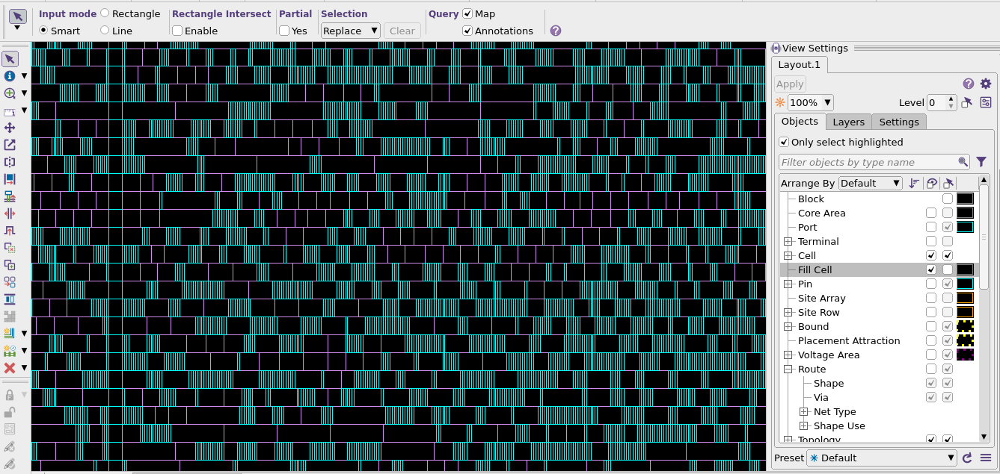
*Fig. 1: ICC2 layout showing filler cell placement across standard cell rows*

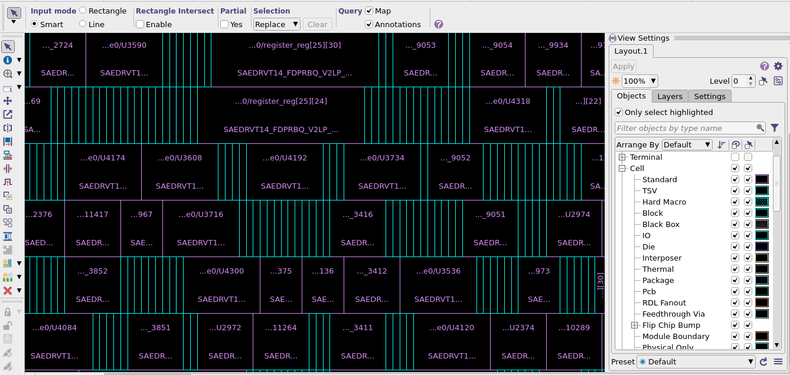
*Fig. 2: Zoomed view showing individual filler cells between standard cells*

```tcl
# Insert filler cells
create_stdcell_fillers \
    -lib_cells {saed14rvt_base_ff0p715v125c/SAEDRVT14_FILL1}

# Power/ground connections
connect_pg_net -net VSS [get_pins */VSS]
connect_pg_net -net VDD [get_pins */VDD]

# Remove fillers causing DRC violations
remove_stdcell_fillers_with_violation

# Verify routing
check_routes
```

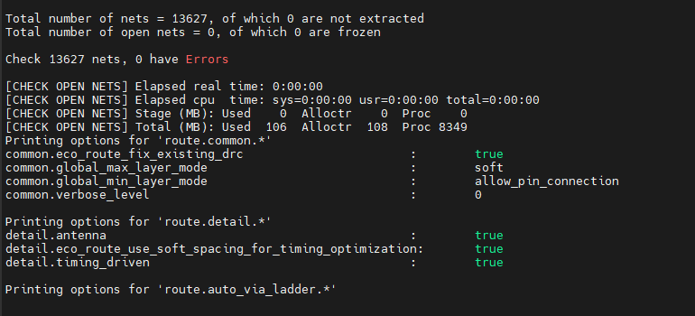
*Fig. 3: check_routes result — 13,627 nets checked, 0 errors after filler insertion*

---

## Section 2 — Signoff DRC

```tcl
set_app_options -name signoff.check_drc.runset \
    -value .../saed14nm_1p9m_drc_rules.rs
set_app_options -name signoff.check_drc.max_errors_per_rule -value 1000
signoff_check_drc
```

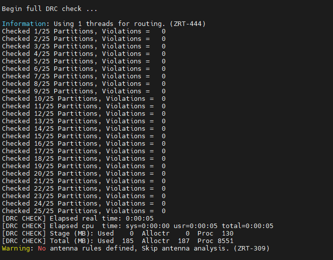
*Fig. 4: ICV DRC run — 25 partitions checked, results summary*

| Rule | Description | Violations |
|------|-------------|-----------|
| M3.A.1 | M3 minimum area ≥ 0.005 µm² | 4,117 |
| M6.S.3.4 | Minimum spacing on M6 | 24 |
| M7.S.3.4 | Minimum spacing on M7 | 2 |
| M8.S.3.4 | Minimum spacing on M8 | 2,070 |
| M9.S.1.2 | Minimum notch ≥ 0.04 µm | 16,468 |
| **Total** | | **22,681** |

> All violations are PDK-inherent (non-Zroute-modifiable standard cell geometries). Expected in academic SAED14nm RTL-to-GDS flows.

### DRC Auto-Fix

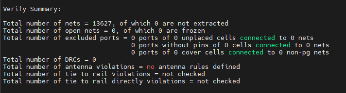
*Fig. 5: Auto-fix summary — violations not fixable due to Zroute modification limits*

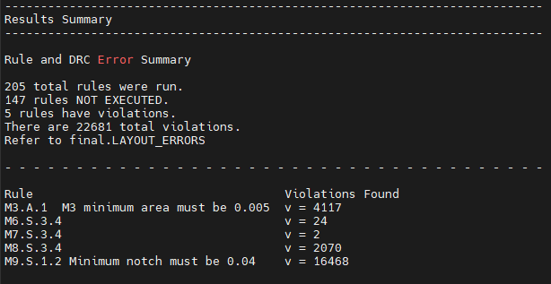
*Fig. 6: signoff_fix_drc output — 205 rules run, 5 with violations, 22,681 total*

---

## Section 3 — LVS Verification

```tcl
check_routes
check_lvs
```

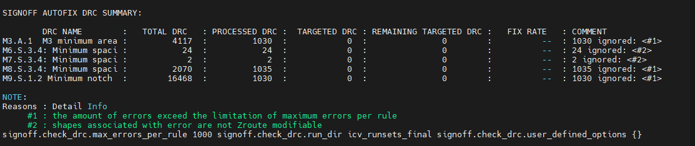
*Fig. 7: SIGNOFF AUTOFIX DRC SUMMARY — processed DRC counts per rule*

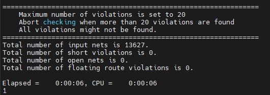
*Fig. 8: check_lvs — 0 shorts, 0 opens, 0 floating route violations across 13,627 nets*

| Check | Result |
|-------|--------|
| Total nets | 13,627 |
| Short violations | **0 ✅** |
| Open net violations | **0 ✅** |
| Floating route violations | **0 ✅** |

---

## Section 4 — Output Files Generated

```tcl
write_verilog -include {all}              decode_all_netlist.v
write_verilog -exclude {all_physical_cells} decode_physical_netlist.v
write_sdc -output decode.sdc
write_sdf decode.sdf
write_parasitics -output decode
write_gds decode.gds
```

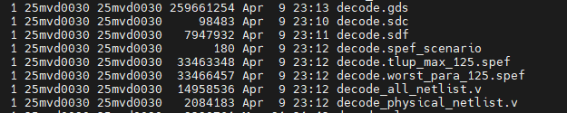
*Fig. 9: Directory listing showing all generated output files with timestamps*

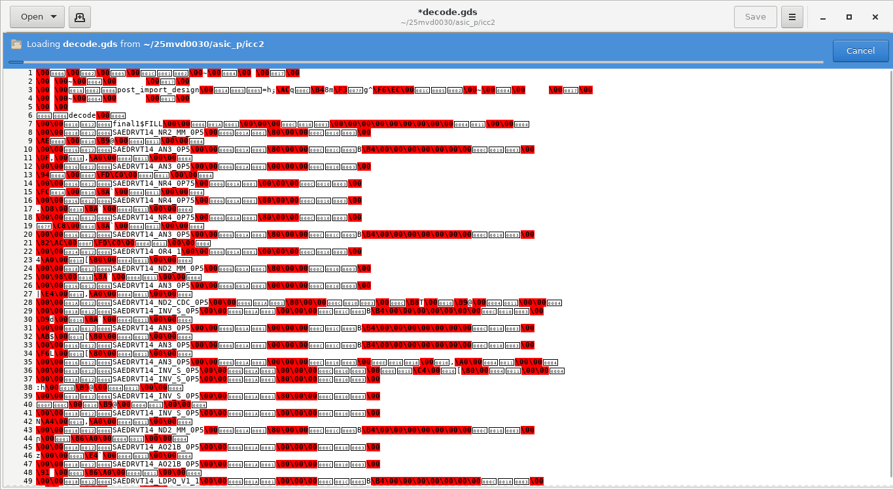
*Fig. 10: decode.gds opened in ICC2 — complete GDSII layout for tape-out*

| File | Size | Description |
|------|------|-------------|
| `decode.gds` | 259.7 MB | GDSII layout — tape-out file |
| `decode.sdc` | 98.5 KB | Synopsys Design Constraints |
| `decode.sdf` | 7.9 MB | Standard Delay Format |
| `decode.tlup_max_125.spef` | 33.5 MB | SPEF (max parasitic corner) |
| `decode.worst_para_125.spef` | 33.5 MB | SPEF (worst parasitic corner) |
| `decode_all_netlist.v` | 15.0 MB | Full physical netlist |
| `decode_physical_netlist.v` | 2.1 MB | Logical netlist (std cells only) |

---

## Section 5 — Clock Distribution Analysis

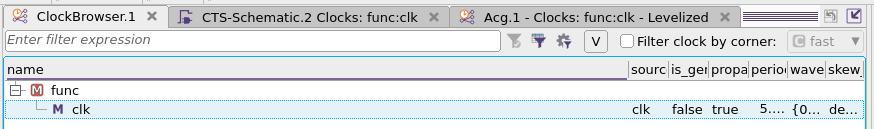
*Fig. 10: Clock browser — clk signal, func mode, propagated*

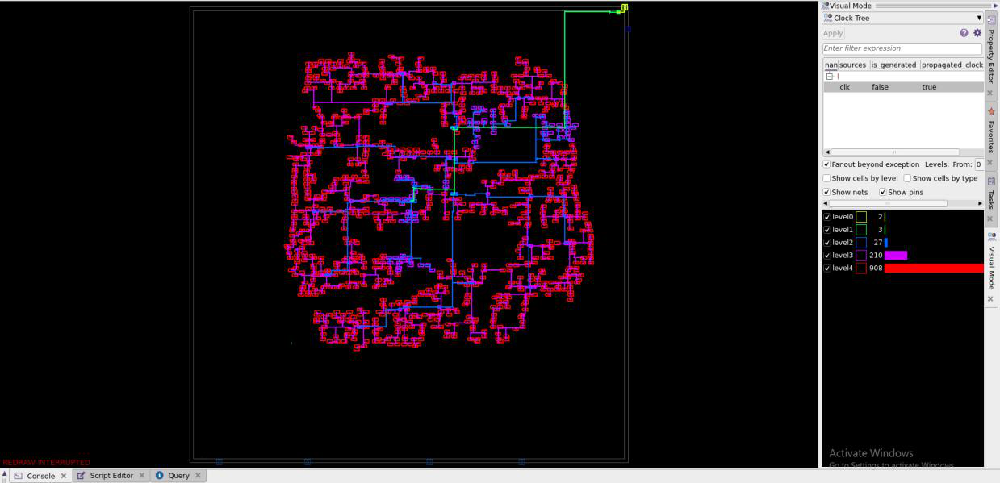
*Fig. 11: Clock tree distribution — 5 levels shown (level0–level4: 2, 3, 27, 210, 900 cells)*

| Parameter | Value |
|-----------|-------|
| Clock levels | 3 |
| Clock sinks | 24 |
| Global skew | ~0.00 ns |
| Max latency | ~0.03 ns |
| Trans DRC violations | 0 ✅ |
| Cap DRC violations | 0 ✅ |

---

## Section 6 — Cell & Power Density

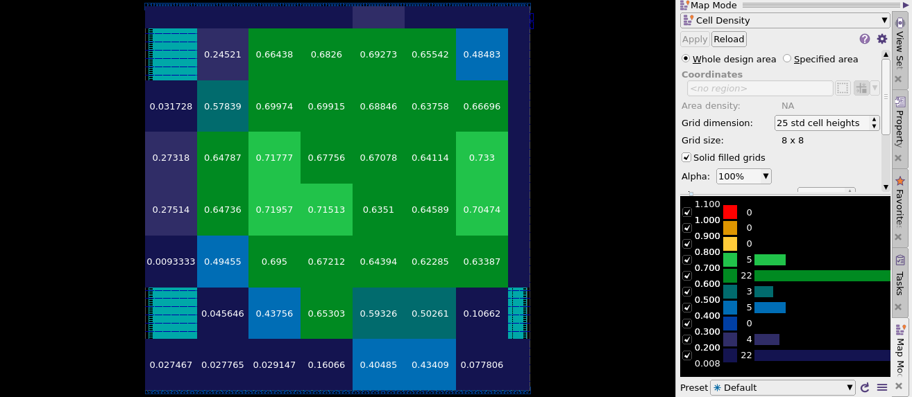
*Fig. 12: Cell density map — 8×8 grid, values 0.009–0.733 across core area*

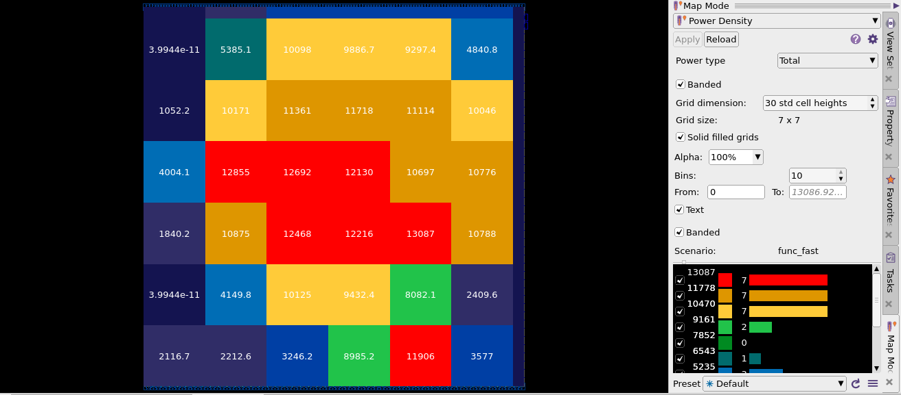
*Fig. 13: Power density map — 7×7 grid, func_fast scenario, peak ~13,087 in central region*

| Metric | Value |
|--------|-------|
| Cell density range | 0.009 (periphery) → 0.733 (centre) |
| Peak power density | ~13,087 units (func_fast, central logic) |

---

## Section 7 — Design Schematic

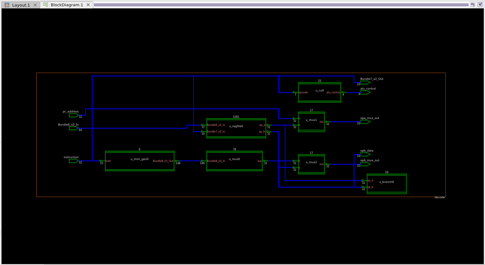
*Fig. 14: Block diagram schematic view of the complete decode design*

---

## Section 8 — Physical Netlist Equivalence (Formality)

```tcl
read_db -tech .../saed14rvt_base_ff0p715v125c.db
read_verilog -r ../vcs/decode.v    ; set_top decode
read_verilog -i decode_all_netlist.v ; set_top decode
match ; verify
```

| Metric | Result |
|--------|--------|
| All compare points | Passed ✅ |
| Failing | 0 ✅ |
| **Status** | **Verification SUCCEEDED ✅** |

---

## Results Summary

| Task | Result |
|------|--------|
| Filler cell insertion | ✅ 0 routing violations after insertion |
| Signoff DRC | ⚠️ 22,681 violations (PDK-inherent, non-modifiable) |
| LVS | ✅ 0 shorts / 0 opens / 0 floating across 13,627 nets |
| Output files | ✅ GDS, SDF, SPEF ×2, SDC, netlists ×2 |
| Clock tree | ✅ 3 levels, 24 sinks, ~0 ns skew |
| Formality (physical vs RTL) | ✅ Verification SUCCEEDED |
