# Task 5 — Full ASIC Flow: 8-bit Restoring Divider

> **Design:** `restoring_divider_8bit`  
> **Tools:** VCS + Verdi · Design Compiler · PrimeTime · Formality · IC Compiler II  
> **Technology:** SAED 14nm RVT (ff0p715v125c)  
> **Date:** Fri Apr 10, 2026  

---

## Objective

Complete RTL-to-GDS ASIC flow for an 8-bit restoring divider — from functional verification through logic synthesis, formal verification, pre-layout STA with ECO fix, and full physical design.

---

## Design — `restoring_divider_8bit`

FSM-based iterative restoring division. Each quotient bit computed per clock cycle — 8-cycle latency for 8-bit inputs.

```verilog
module restoring_divider_8bit (
    input  wire       clk, rst, start,
    input  wire [7:0] dividend, divisor,
    output reg  [7:0] quotient, remainder,
    output reg        done   // pulses high 1 cycle when result valid
);
```

---

## Section 1 — Functional Verification (VCS + Verdi)

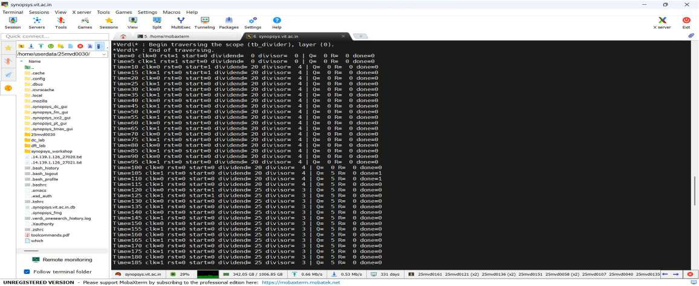
*Fig. 1a: VCS functional verification terminal output — test vectors running*

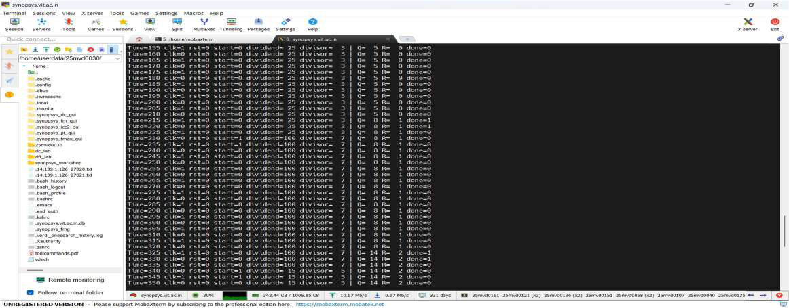
*Fig. 1b: VCS terminal continued — more test vectors*

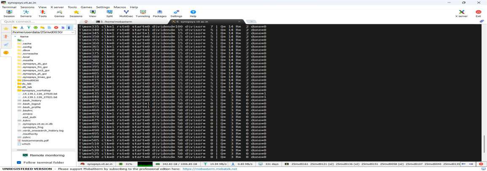
*Fig. 1c: VCS terminal — final test cases and completion*

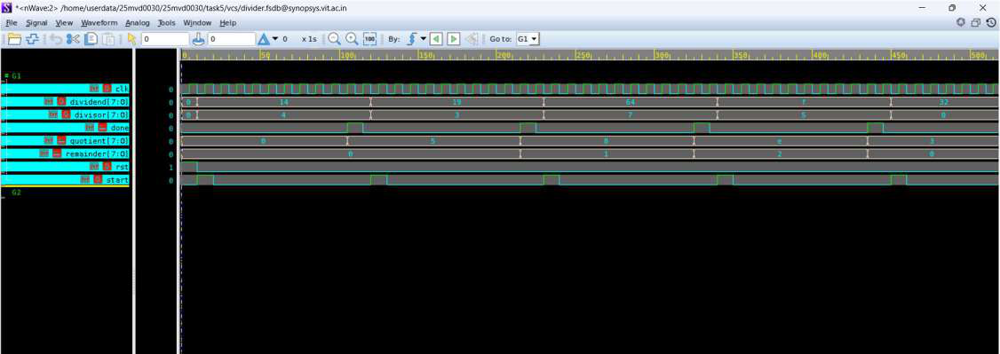
*Fig. 2: Verdi waveform — clock, reset, start, dividend, divisor, quotient, remainder, done signals*

| Dividend | Divisor | Quotient | Remainder | Status |
|----------|---------|----------|-----------|--------|
| 14 | 4 | 3 | 2 | ✅ PASS |
| 19 | 3 | 6 | 1 | ✅ PASS |
| 64 | 7 | 9 | 1 | ✅ PASS |
| 15 | 5 | 3 | 0 | ✅ PASS |
| 100 | 7 | 14 | 2 | ✅ PASS |

All test vectors passed. `done` correctly pulses 1 cycle per completed operation.

---

## Section 2 — Logic Synthesis (Design Compiler)

### Synthesis Schematics

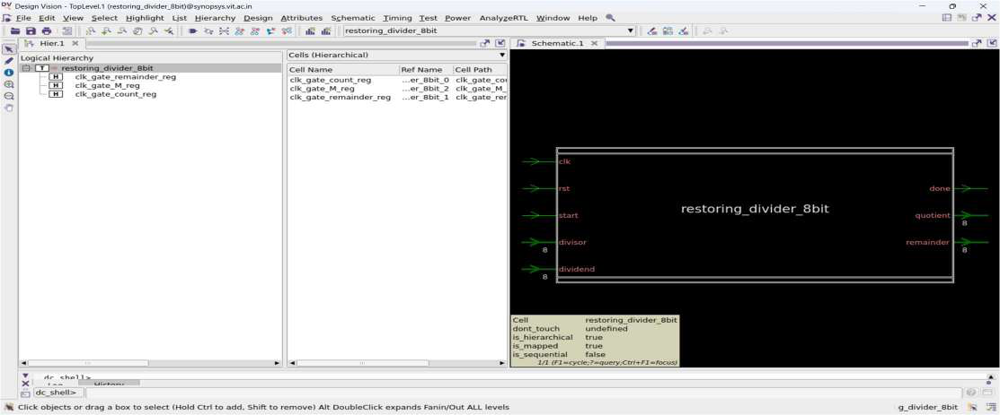
*Fig. 3a: Top-level block diagram after synthesis — restoring_divider_8bit hierarchy*

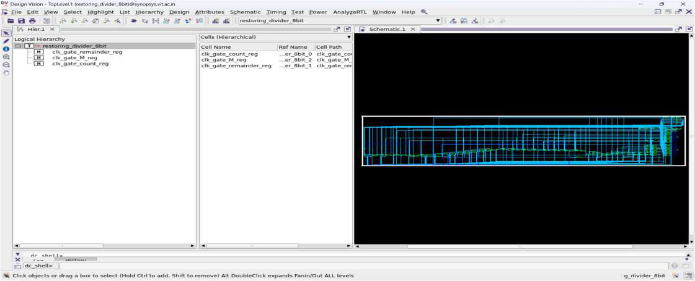
*Fig. 3b: Gate-level schematic view — mapped standard cell netlist*

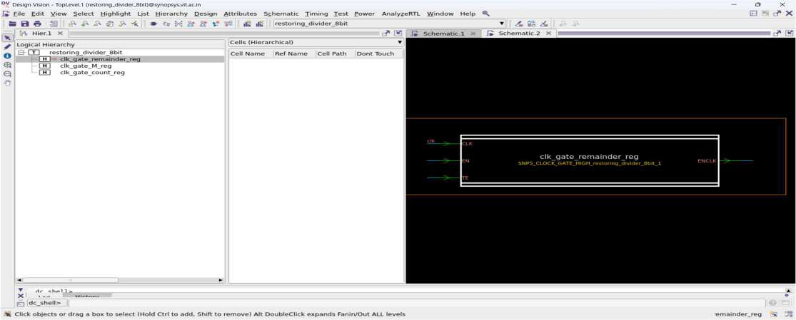
*Fig. 3c: Schematic of clk_gate_remainder_reg clock gating cell*

### Area Report

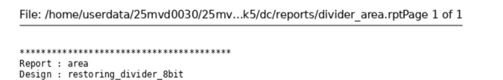
*Fig. 4: Area report — restoring_divider_8bit, SAED14nm RVT, Apr 10 21:28:39 2026*

| Metric | Value |
|--------|-------|
| Ports | 48 |
| Nets | 177 |
| Total Cells | 137 |
| Combinational cells | 84 |
| Sequential cells | **50** |
| Buf/Inv cells | 18 |
| Combinational area | 31.924 µm² |
| Non-combinational area | 52.525 µm² |
| Net interconnect area | 81.538 µm² |
| **Total cell area** | **84.449 µm²** |
| **Total design area** | **165.987 µm²** |

### Power Report

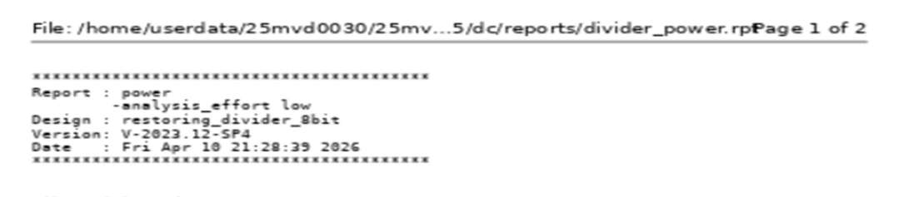
*Fig. 5: Power report — ff0p715v125c operating conditions*

| Component | Power | % |
|-----------|-------|---|
| Cell Internal | 14.707 µW | 34% |
| Net Switching | 28.018 µW | 66% |
| **Total Dynamic** | **42.725 µW** | 100% |
| Cell Leakage | 2.444 µW | — |
| **Total Power** | **45.169 µW** | — |

| Power Group | Total | % |
|-------------|-------|---|
| clock_network | 31.711 µW | 70.21% |
| register | 4.622 µW | 10.23% |
| combinational | 8.836 µW | 19.56% |

---

## Section 3 — Formal Verification (Formality)

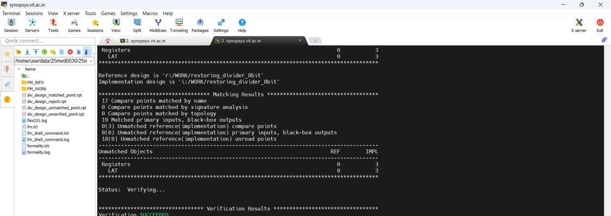
*Fig. 6: Formality — Verification SUCCEEDED, 17/17 compare points passing*

```tcl
read_db -tech .../saed14rvt_base_ff0p715v125c.db
read_verilog -r restoring_divider_8bit.v  ; # RTL reference
read_verilog -i divider_netlist.v         ; # DC netlist
match ; verify
```

| Metric | Value |
|--------|-------|
| Matched compare points | 17 |
| Passing (equivalent) | **17 ✅** |
| Failing | **0 ✅** |
| **Status** | **Verification SUCCEEDED ✅** |

---

## Section 4 — Pre-Layout STA (PrimeTime)

### Initial Results — Hold Violations

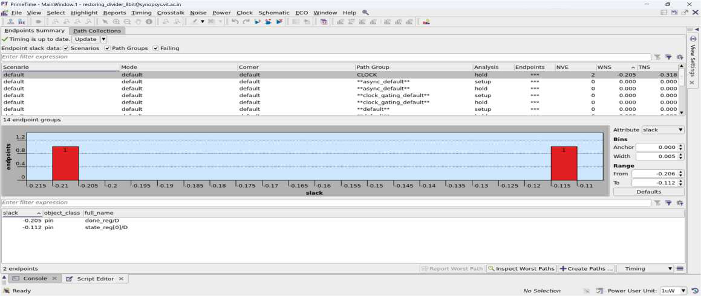
*Fig. 7: PrimeTime — 2 hold-violating endpoints (done_reg/D, state_reg[0]/D), WNS = −0.205 ns*

| Check | WNS (ns) | TNS (ns) | Violations |
|-------|---------|---------|-----------|
| Setup | 0.00 ✅ | 0.00 ✅ | 0 ✅ |
| Hold | **−0.205 ❌** | **−0.318 ❌** | **2** |

Critical path: 2 logic levels, ~1.64 ns delay.

### ECO Fix — Buffer Insertion

```tcl
fix_eco_timing -type hold -slack_lesser_than 0 \
    -buffer_list {SAEDRVT14_BUF_ECO_1}
```

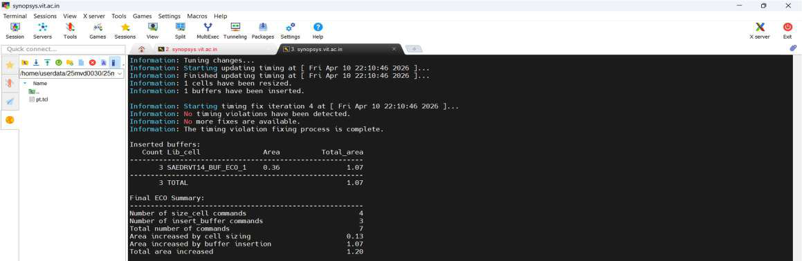
*Fig. 8: PrimeTime after ECO — all 14 endpoint groups show WNS = 0.000, TNS = 0.000*

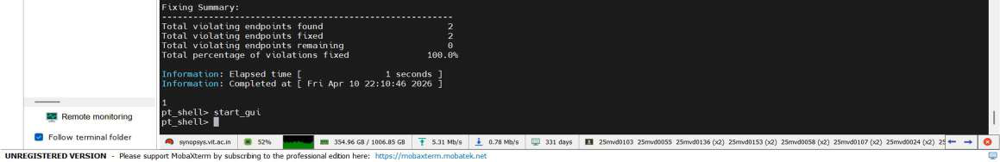
*Fig. 9: Terminal — 3 buffers inserted, 4 cell resizes, 2/2 violations fixed (100%)*

| ECO Action | Count |
|------------|-------|
| Buffers inserted | 3 × SAEDRVT14_BUF_ECO_1 |
| Cells resized | 4 |
| Area increase | 1.20 µm² |
| Violations fixed | **2 / 2 (100%)** |

### Post-ECO Results

| Check | WNS | TNS | Violations |
|-------|-----|-----|-----------|
| Setup | **0.00 ns ✅** | **0.00 ns ✅** | **0 ✅** |
| Hold | **0.00 ns ✅** | **0.00 ns ✅** | **0 ✅** |

---

## Section 5 — Physical Design (ICC2)

### Floorplan

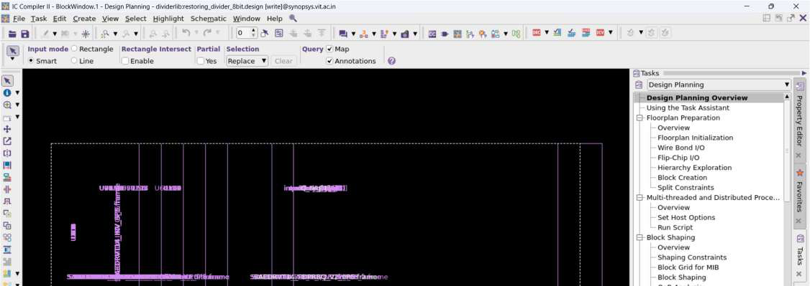
*Fig. 10: Initial floorplan stage — die boundary and site rows defined*

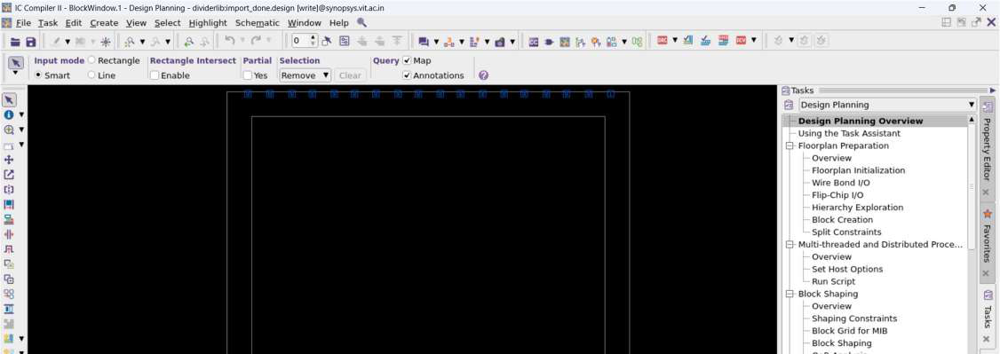
*Fig. 11: Pin placement stage — I/O pins assigned to die edges*

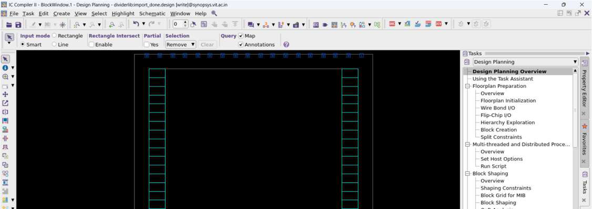
*Fig. 12: Boundary cells placed at core perimeter*

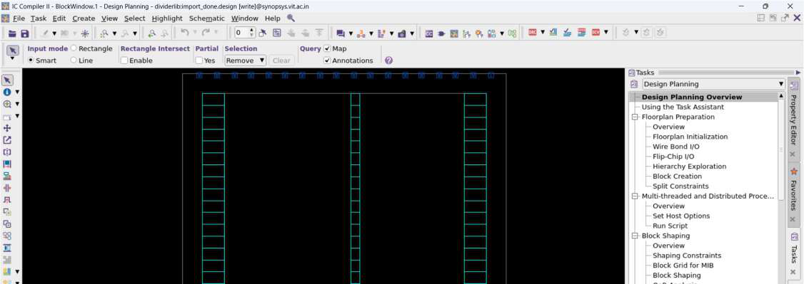
*Fig. 13: Tap cell insertion complete — floorplan stage done*

### Power Planning

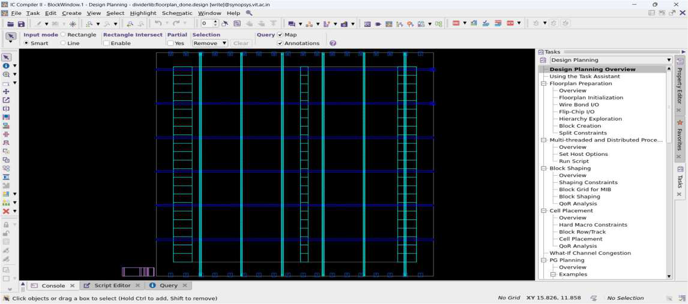
*Fig. 14: VDD/VSS horizontal rails in standard cell rows*

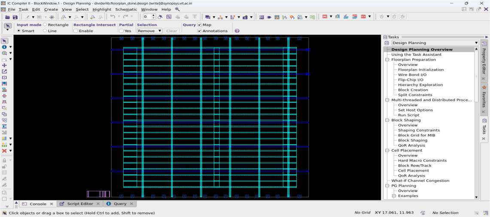
*Fig. 15: Full power mesh (rails + vertical/horizontal stripes) — power planning complete*

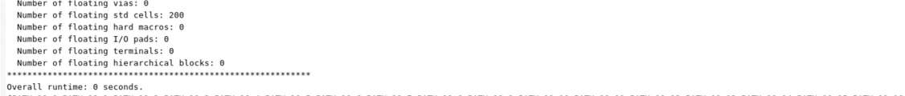
*Fig. 16: check_pg_drc result — No errors found ✅*

### Placement

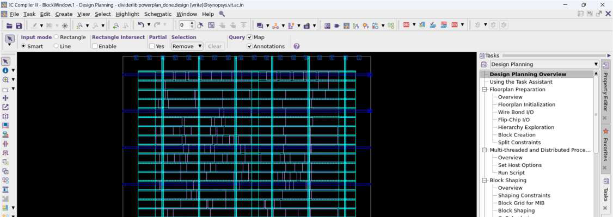
*Fig. 17: 200 standard cells placed — ICC2 placement view*

### Clock Tree Synthesis

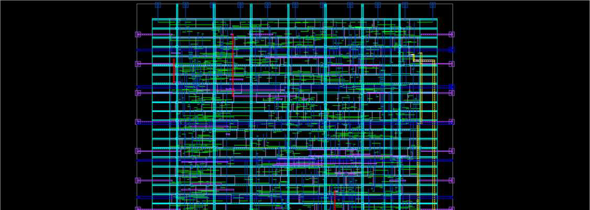
*Fig. 18: Post-CTS layout — clock tree buffers visible as colored cells*

### Routing

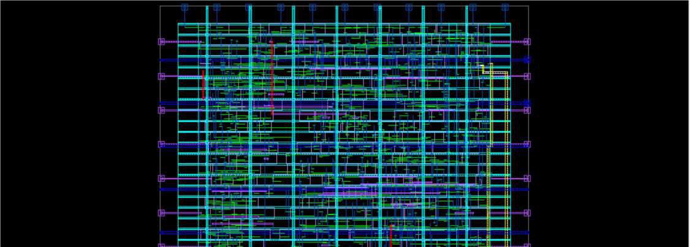
*Fig. 19: Fully routed design — all metal layers, global and detail routing complete*

### Filler Cell Insertion

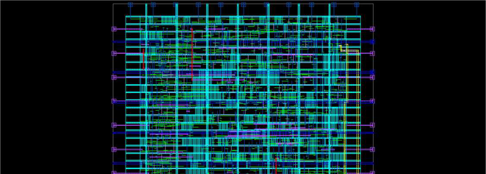
*Fig. 20: Post-filler layout — empty sites filled, core fully populated*

### Physical Design Summary

| Stage | Status |
|-------|--------|
| Floorplan (pins, boundary, tap cells) | ✅ |
| Power Planning (rails + mesh, PG DRC clean) | ✅ |
| Standard Cell Placement (200 cells) | ✅ |
| Clock Tree Synthesis | ✅ |
| Routing | ✅ |
| Filler Cell Insertion | ✅ |

---

## Results Summary

| Stage | Key Metric | Result |
|-------|-----------|--------|
| Functional Verification | Test vectors | 5 / 5 ✅ |
| Logic Synthesis | Total area | 165.987 µm² |
| Logic Synthesis | Total power | 45.169 µW |
| Logic Synthesis | Sequential cells | 50 FFs |
| Formal Verification | Equivalence | 17/17 PASS ✅ |
| Pre-Layout STA (initial) | Hold WNS | −0.205 ns ❌ |
| Pre-Layout STA (post-ECO) | Hold WNS | 0.00 ns ✅ |
| Pre-Layout STA (post-ECO) | Setup WNS | 0.00 ns ✅ |
| Physical Design | PG DRC | Clean ✅ |
| Physical Design | All stages | Complete ✅ |

---

## Conclusion

The 8-bit restoring divider was successfully taken through a complete RTL-to-GDS ASIC flow. Functional simulation confirmed correct division. Logic synthesis mapped the design to SAED14nm standard cells (165.99 µm², 45.17 µW). Formality confirmed 17/17 equivalence points passing. PrimeTime identified 2 hold violations resolved by ECO buffer insertion (100% fix rate). Physical design in ICC2 completed all stages — floorplan, power planning, placement, CTS, routing, and filler insertion — delivering a fully implemented design ready for signoff.
